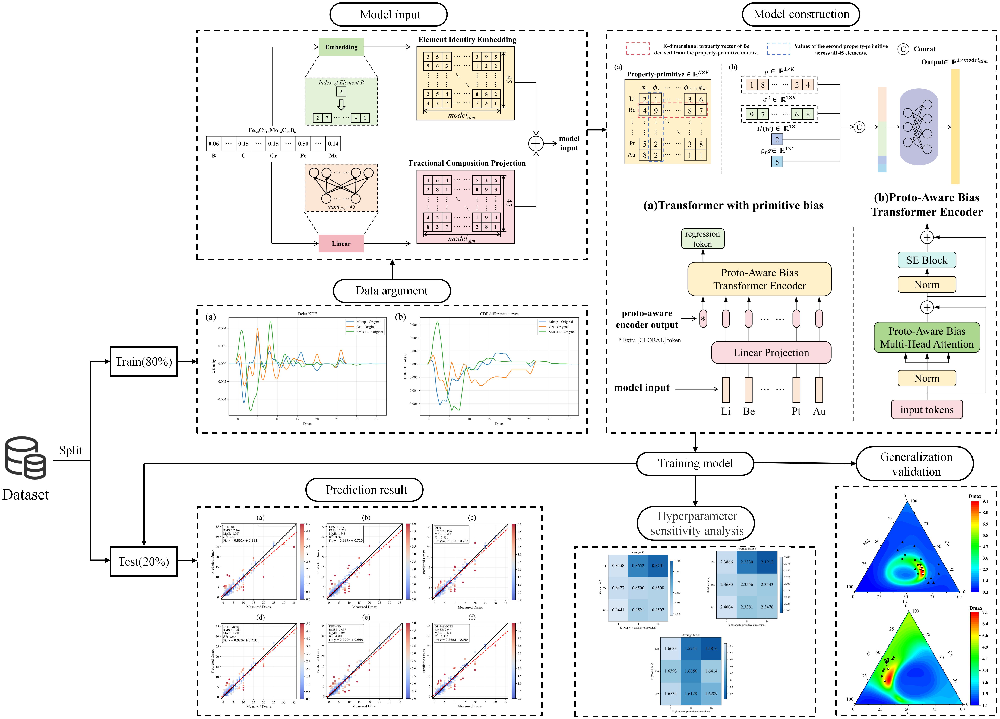

# Dmax-ProtoNet(DPN)
This is the official repository providing data and code accompanying the paper A Method Based on Property Primitives and Transformer for Predicting the Critical Casting Diameter of Bulk Metallic Glasses

## Model Overview

Below are the model architecture.

  

## License

 
The content of this repository is licensed under <a href="http://creativecommons.org/licenses/by-nc-sa/4.0/?ref=chooser-v1" target="_blank" rel="license noopener noreferrer" style="display:inline-block;">CC BY-NC-SA 4.0</a>

